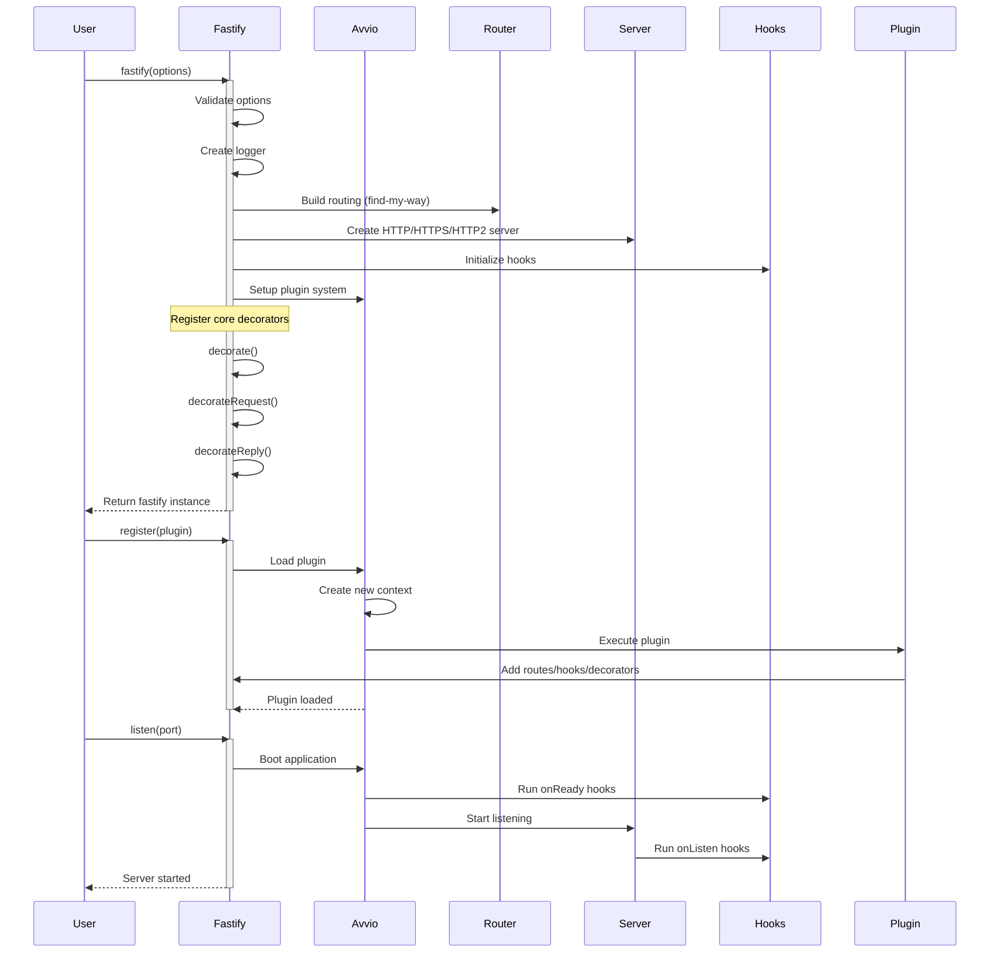
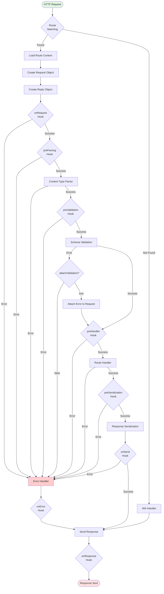

# Fastify Architecture

## Overview

Fastify is a high-performance web framework for Node.js built on a modular architecture with a focus on developer experience and low overhead. This document provides architectural diagrams and explanations of Fastify's core components and flows.

## Table of Contents

1. [High-Level Architecture](#high-level-architecture)
2. [Initialization Flow](#initialization-flow)
3. [Request Lifecycle](#request-lifecycle)
4. [Component Architecture](#component-architecture)
5. [Plugin System](#plugin-system)
6. [Hooks System](#hooks-system)

## High-Level Architecture

```mermaid
graph TB
    subgraph "Fastify Core"
        A[fastify.js<br/>Main Entry Point] --> B[Server Creation]
        B --> C[HTTP/HTTPS/HTTP2 Server]
        
        A --> D[Plugin System<br/>Avvio]
        A --> E[Router<br/>find-my-way]
        A --> F[Schema Controller]
        A --> G[Hooks System]
        A --> H[Content Type Parser]
        
        subgraph "Core Libraries"
            I[lib/server.js<br/>Server Factory]
            J[lib/route.js<br/>Route Management]
            K[lib/context.js<br/>Encapsulation Context]
            L[lib/request.js<br/>Request Object]
            M[lib/reply.js<br/>Reply Object]
            N[lib/hooks.js<br/>Hook Management]
            O[lib/contentTypeParser.js<br/>Body Parsing]
            P[lib/validation.js<br/>Schema Validation]
            Q[lib/errors.js<br/>Error Handling]
        end
        
        D --> K
        E --> J
        F --> P
        G --> N
        H --> O
    end
    
    subgraph "External Dependencies"
        R[pino<br/>Logger]
        S[ajv<br/>JSON Schema Validator]
        T[fast-json-stringify<br/>Serializer]
        U[find-my-way<br/>Router]
        V[avvio<br/>Plugin Boot]
    end
    
    A --> R
    F --> S
    F --> T
    E --> U
    D --> V
```



## Initialization Flow



## Request Lifecycle



## Component Architecture

```mermaid
graph TB
    subgraph "Request/Reply Objects"
        Request[Request<br/>- id<br/>- params<br/>- query<br/>- headers<br/>- body<br/>- raw]
        Reply[Reply<br/>- statusCode<br/>- headers<br/>- sent<br/>- raw]
    end
    
    subgraph "Context System"
        Context[Context<br/>- schema<br/>- handler<br/>- errorHandler<br/>- hooks<br/>- config]
        Encapsulation[Encapsulation<br/>- Isolated plugin contexts<br/>- Inheritance chain]
    end
    
    subgraph "Schema Management"
        SchemaController[Schema Controller<br/>- Validator Compiler<br/>- Serializer Compiler<br/>- Schema Storage]
        Validation[Validation<br/>- Body<br/>- Headers<br/>- Query<br/>- Params]
        Serialization[Serialization<br/>- Response schemas<br/>- Fast JSON stringify]
    end
    
    subgraph "Content Handling"
        ContentTypeParser[Content Type Parser<br/>- JSON<br/>- Text<br/>- Custom parsers]
        BodyLimit[Body Limit<br/>- Global limit<br/>- Route-specific limit]
    end
    
    subgraph "Error Management"
        ErrorHandler[Error Handler<br/>- Default handler<br/>- Custom handlers<br/>- Error serialization]
        Errors[Error Codes<br/>- FST_ERR_*<br/>- Typed errors]
    end
    
    subgraph "Logging"
        Logger[Logger<br/>- Pino integration<br/>- Child loggers<br/>- Serializers]
    end
    
    Context --> Request
    Context --> Reply
    Context --> SchemaController
    Context --> ErrorHandler
    
    Request --> ContentTypeParser
    ContentTypeParser --> BodyLimit
    
    SchemaController --> Validation
    SchemaController --> Serialization
    
    ErrorHandler --> Errors
    Request --> Logger
    Reply --> Logger