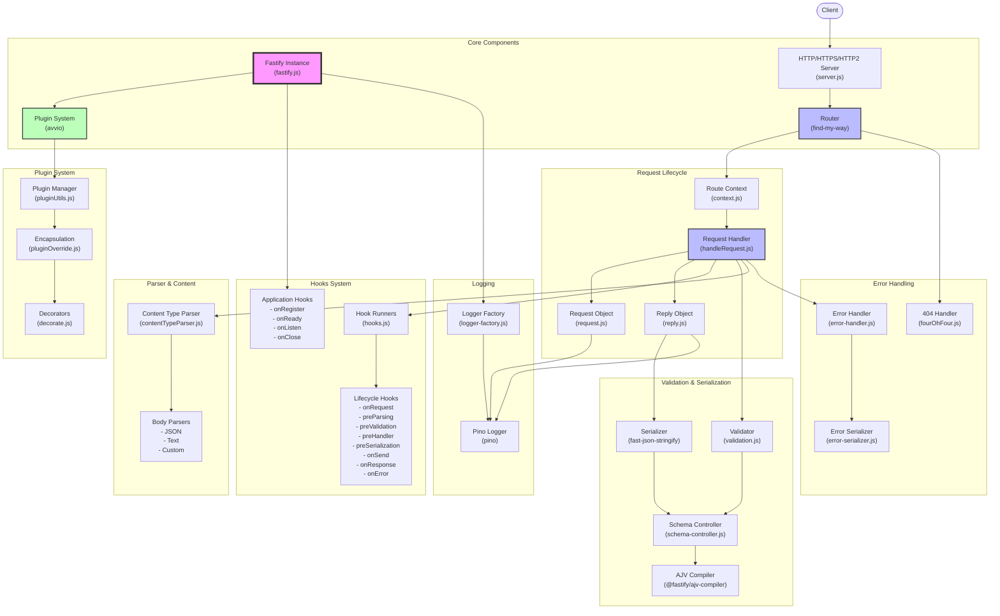
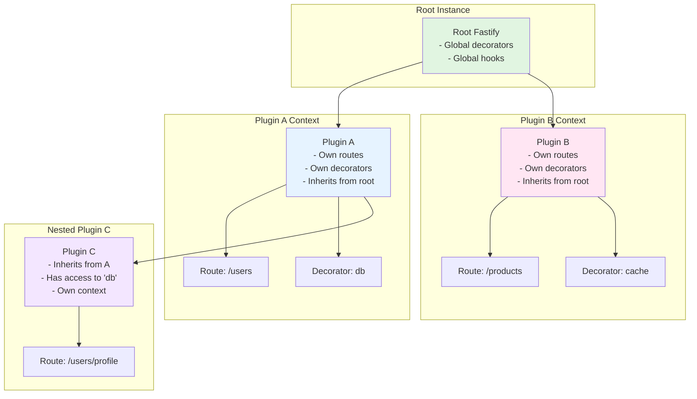
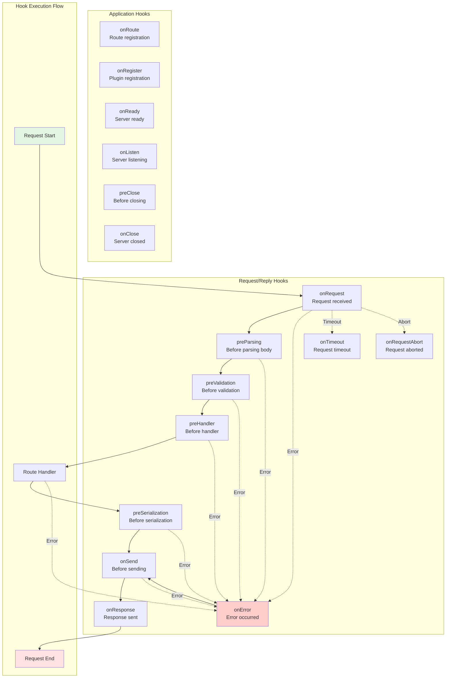
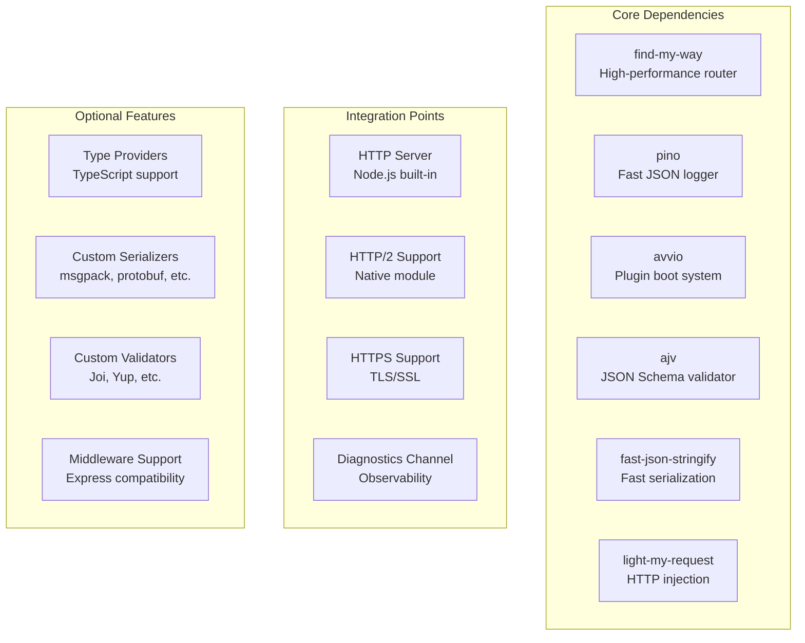

# Fastify Architecture Diagram

## Overview

Fastify is a highly performant and low overhead web framework for Node.js. This document provides a comprehensive architecture diagram and explanation of its core components.

## Architecture Diagram



## Component Descriptions

### Core Components

#### Fastify Instance (`fastify.js`)
- Main entry point and factory function
- Creates and configures the server instance
- Manages global settings and state
- Provides the public API for route registration, plugins, decorators, etc.
- Current version: 5.3.3

#### Router (`find-my-way`)
- High-performance HTTP router
- Supports parametric routes, wildcards, and regular expressions
- Handles route constraints and versioning
- Manages route lookup and dispatching

#### HTTP Server (`server.js`)
- Creates HTTP, HTTPS, or HTTP2 server instances
- Handles server lifecycle (listen, close)
- Manages multiple address bindings (IPv4/IPv6)
- Supports keep-alive, timeouts, and connection management

#### Plugin System (`avvio`)
- Manages asynchronous plugin loading
- Provides encapsulation and inheritance
- Handles plugin dependencies and boot order
- Supports plugin timeouts and error handling

### Request Lifecycle Components

#### Request Object (`request.js`)
- Wraps Node.js IncomingMessage
- Provides convenient accessors for headers, params, query, body
- Supports request decorators
- Manages request ID generation

#### Reply Object (`reply.js`)
- Wraps Node.js ServerResponse
- Handles response serialization
- Manages response headers and status codes
- Supports streaming and async responses
- Implements reply decorators

#### Route Context (`context.js`)
- Stores route-specific configuration
- Manages route-level hooks
- Contains schema validators and serializers
- Handles route-specific error handlers

#### Request Handler (`handleRequest.js`)
- Orchestrates the request lifecycle
- Runs hooks in the correct order
- Handles body parsing and validation
- Manages error propagation

### Hooks System

#### Application Hooks
- **onRegister**: Called when a plugin is registered
- **onReady**: Called when the server is ready
- **onListen**: Called when the server starts listening
- **onClose**: Called when the server is closing
- **preClose**: Called before the close sequence

#### Lifecycle Hooks (per request)
1. **onRequest**: First hook, can modify request
2. **preParsing**: Before body parsing
3. **preValidation**: Before schema validation
4. **preHandler**: Before route handler
5. **preSerialization**: Before response serialization
6. **onSend**: Before sending response
7. **onResponse**: After response sent
8. **onError**: On any error
9. **onTimeout**: On request timeout
10. **onRequestAbort**: On request abort

### Validation & Serialization

#### Schema Controller
- Manages JSON schemas
- Compiles validators and serializers
- Supports custom compilers
- Handles schema references

#### Validation
- Uses AJV for JSON schema validation
- Validates headers, params, querystring, and body
- Supports custom error messages
- Can attach validation errors to request

#### Serialization
- Uses fast-json-stringify for performance
- Serializes response based on schema
- Supports custom serializers
- Handles different response codes

### Content Parsing

#### Content Type Parser
- Manages body parsing strategies
- Built-in parsers for JSON and text
- Supports custom parsers
- Handles content-type negotiation
- Implements body size limits

### Plugin System Features

#### Encapsulation
- Provides isolated contexts for plugins
- Inherits from parent context
- Prevents plugin conflicts
- Supports scoped decorators

#### Decorators
- Extends core objects (fastify, request, reply)
- Type-safe in TypeScript
- Supports getters/setters
- Inherited through encapsulation

### Error Handling

#### Error Handler
- Centralized error processing
- Custom error handlers per route
- Error serialization
- Status code mapping

#### 404 Handler
- Customizable not-found responses
- Supports encapsulated 404 handlers
- Integrates with router

### Logging

#### Logger Factory
- Creates scoped loggers
- Integrates with Pino
- Supports custom serializers
- Child loggers for requests

## Request Flow

1. **Client Request** → HTTP Server receives request
2. **Routing** → Router finds matching route
3. **Context Creation** → Route context initialized
4. **Request/Reply Objects** → Created with context
5. **Hooks Execution**:
   - onRequest hooks
   - preParsing hooks
   - Body parsing (if needed)
   - preValidation hooks
   - Schema validation
   - preHandler hooks
6. **Route Handler** → User-defined handler executes
7. **Response Processing**:
   - preSerialization hooks
   - Response serialization
   - onSend hooks
8. **Send Response** → Reply sent to client
9. **Cleanup**:
   - onResponse hooks
   - Logger output

## Key Design Principles

1. **Performance First**: Optimized for low overhead and high throughput
2. **Schema-Based**: JSON Schema for validation and serialization
3. **Extensible**: Rich plugin ecosystem with encapsulation
4. **Developer Friendly**: Excellent TypeScript support and developer experience
5. **Standards Compliant**: Follows HTTP specifications closely

## Performance Optimizations

- **V8 Optimizations**: Code structured for V8 optimization
- **Schema Compilation**: Validation and serialization compiled at startup
- **Efficient Routing**: Radix tree-based router
- **Minimal Allocations**: Reuses objects where possible
- **Fast Path**: Optimized paths for common cases

## Security Features

- **Prototype Poisoning Protection**: Built-in protection
- **Content Type Validation**: Strict content-type checking
- **Request Size Limits**: Configurable body limits
- **Error Information Hiding**: Production-safe error responses

## Plugin System

```mermaid
graph TB
    subgraph "Plugin Architecture"
        A[Plugin Registration] --> B[Avvio Boot System]
        B --> C[Context Creation]
        
        subgraph "Encapsulation"
            D[Parent Context]
            E[Child Context 1]
            F[Child Context 2]
            G[Grandchild Context]
            
            D --> E
            D --> F
            E --> G
        end
        
        C --> D
        
        subgraph "Plugin Features"
            H[Routes]
            I[Decorators]
            J[Hooks]
            K[Custom Parsers]
            L[Schemas]
        end
        
        E --> H
        E --> I
        E --> J
        E --> K
        E --> L
    end
    
    subgraph "Plugin Loading Process"
        M[register(plugin)] --> N{Plugin Type}
        N -->|Async| O[Promise-based]
        N -->|Callback| P[Callback-based]
        N -->|Sync| Q[Synchronous]
        
        O --> R[Execute Plugin]
        P --> R
        Q --> R
        
        R --> S[Apply Decorations]
        S --> T[Register Routes]
        T --> U[Setup Hooks]
        U --> V[Plugin Ready]
    end
    
    subgraph "Plugin Options"
        W[fastify-plugin<br/>- No encapsulation<br/>- Decorators leak to parent]
        X[Regular Plugin<br/>- Encapsulated<br/>- Isolated context]
        Y[Plugin Metadata<br/>- name<br/>- version<br/>- decorators<br/>- dependencies]
    end
```

### Plugin Encapsulation Example



## Hooks System



### Hook Registration and Inheritance

```mermaid
graph LR
    subgraph "Hook Registration"
        A[Global Hooks<br/>fastify.addHook()] --> B[Plugin Hooks<br/>Inherited + Own]
        B --> C[Route Hooks<br/>All inherited + Route-specific]
    end
    
    subgraph "Hook Types"
        D[Synchronous<br/>function(request, reply, done)]
        E[Async/Promise<br/>async function(request, reply)]
        F[Error Hooks<br/>function(error, request, reply)]
    end
    
    subgraph "Hook Features"
        G[Encapsulated<br/>Inherit from parent]
        H[Ordered Execution<br/>Parent → Child]
        I[Error Propagation<br/>Stop on error]
        J[Async Support<br/>Promise-based]
    end
```

## Key Architectural Patterns

### 1. **Encapsulation via Context**
- Each plugin creates an isolated context
- Decorators and hooks are inherited but not shared sideways
- Enables modular application structure

### 2. **Lifecycle Management**
- Clear separation between application lifecycle and request lifecycle
- Hooks provide interception points at each stage
- Async-first design with callback support

### 3. **Schema-Driven Development**
- JSON Schema validation for requests
- Automatic serialization for responses
- Compile-time optimization for performance

### 4. **Error Handling**
- Centralized error handling with custom handlers
- Error hooks for logging and transformation
- Graceful degradation and recovery

### 5. **Performance Optimizations**
- Route compilation at startup
- Schema compilation and caching
- Minimal overhead in hot paths
- Stream support for large payloads

## Dependencies and Integration Points



## Summary

Fastify's architecture is designed around several key principles:

1. **Performance**: Minimal overhead, optimized hot paths, and compile-time optimizations
2. **Developer Experience**: Clear APIs, helpful errors, and excellent TypeScript support
3. **Modularity**: Plugin system with encapsulation for building maintainable applications
4. **Extensibility**: Hooks, decorators, and custom parsers/serializers
5. **Standards-based**: JSON Schema for validation, standard HTTP semantics

The framework achieves high performance while maintaining a clean, extensible architecture that scales from simple APIs to complex microservices.