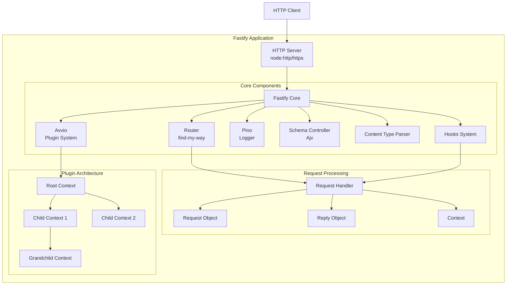
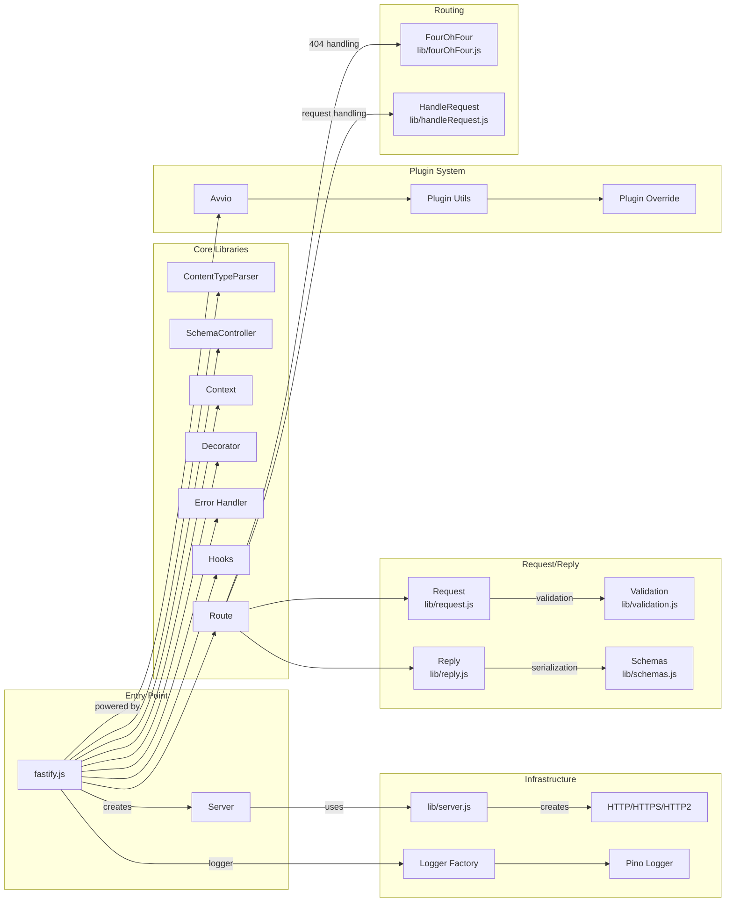
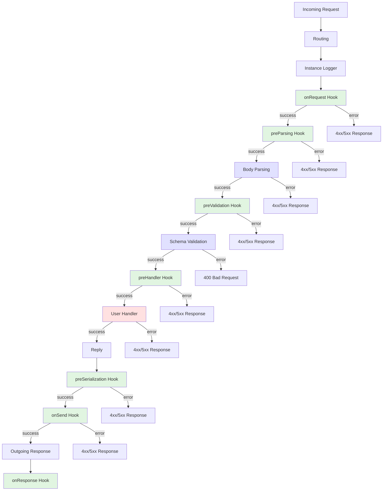
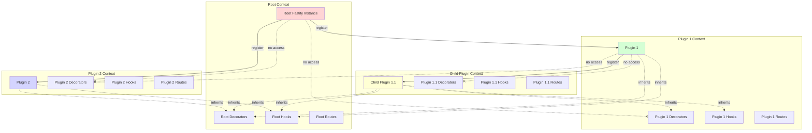
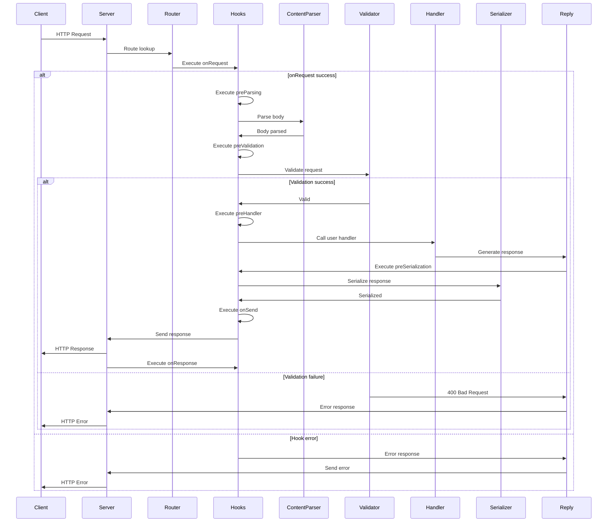

# Fastify Architecture Diagrams

This document provides comprehensive architecture diagrams for the Fastify web framework, illustrating its core components, request lifecycle, plugin system, and overall structure.

## Table of Contents
- [High-Level Architecture Overview](#high-level-architecture-overview)
- [Core Components](#core-components)
- [Request Lifecycle](#request-lifecycle)
- [Plugin System & Encapsulation](#plugin-system--encapsulation)
- [Detailed Component Interactions](#detailed-component-interactions)

## High-Level Architecture Overview



## Core Components



## Request Lifecycle



## Plugin System & Encapsulation



## Detailed Component Interactions



## Key Architecture Characteristics

### 1. **Plugin-Based Architecture**
- Everything is a plugin (routes, decorators, hooks)
- Encapsulated contexts prevent pollution
- Inheritance flows down, not up
- `fastify-plugin` can break encapsulation when needed

### 2. **High Performance Design**
- Efficient routing with find-my-way
- Schema-based validation and serialization
- Minimal overhead in hot paths
- Streaming support

### 3. **Lifecycle Hooks**
- Request/Reply hooks for fine-grained control
- Application hooks for lifecycle management
- Asynchronous hook support
- Error propagation through hook chain

### 4. **Schema-First Approach**
- JSON Schema validation with Ajv
- Automatic serialization optimization
- Type inference support
- Custom schema formats

### 5. **Extensibility**
- Decorators for extending core objects
- Custom content type parsers
- Plugin system via Avvio
- Custom error handlers

### 6. **Logging**
- Pino logger integration
- Request ID tracking
- Child logger support
- Serializer customization

## File Structure Mapping

```
fastify/
├── fastify.js              # Main entry point
├── lib/
│   ├── server.js           # HTTP server creation
│   ├── route.js            # Routing logic
│   ├── request.js          # Request object
│   ├── reply.js            # Reply object
│   ├── context.js          # Encapsulation context
│   ├── hooks.js            # Hooks system
│   ├── contentTypeParser.js # Body parsing
│   ├── schema-controller.js # Schema management
│   ├── validation.js       # Request validation
│   ├── decorate.js         # Decorator system
│   ├── pluginUtils.js      # Plugin utilities
│   ├── logger-factory.js   # Logger creation
│   └── errors.js           # Error definitions
└── types/                  # TypeScript definitions
```

This architecture enables Fastify to achieve high performance while maintaining developer-friendly APIs and strong extensibility through its plugin system.