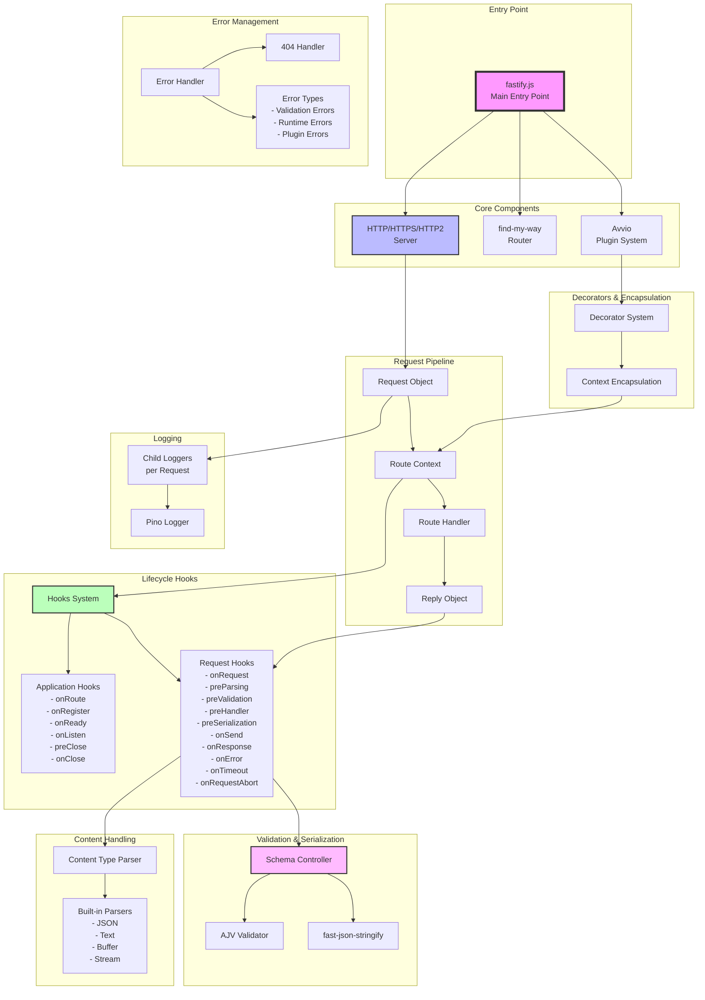
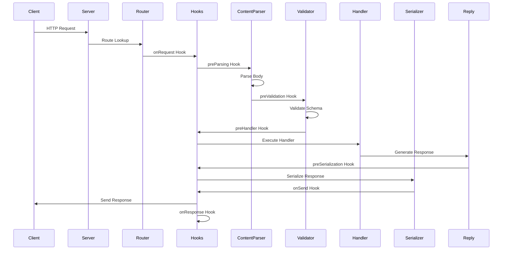
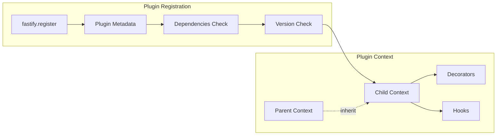

# Fastify Architecture Diagram

## Overview
Fastify is a high-performance web framework for Node.js with a plugin-based architecture, comprehensive lifecycle hooks, and built-in schema validation.

## Core Architecture



## Component Details

### 1. **Entry Point (`fastify.js`)**
- Creates the Fastify instance
- Initializes all core components
- Exposes public API methods
- Sets up default configurations

### 2. **Plugin System (Avvio)**
- Manages asynchronous plugin registration
- Provides encapsulation between plugins
- Handles plugin dependencies
- Supports plugin metadata and versioning

### 3. **Routing (find-my-way)**
- High-performance HTTP router
- Supports parametric and wildcard routes
- Constraint-based routing (versioning, host, etc.)
- Method-based routing

### 4. **Server Layer**
- Supports HTTP/1.1, HTTP/2, and HTTPS
- Configurable timeouts and limits
- Connection management
- Request/Response handling

### 5. **Request Lifecycle**



### 6. **Hook System**
- **Application Hooks**: Control server lifecycle
- **Request Hooks**: Intercept request/response flow
- Supports both sync and async hooks
- Error propagation through hook chain

### 7. **Validation & Serialization**
- JSON Schema validation via AJV
- Fast JSON serialization via fast-json-stringify
- Compiled schemas for performance
- Custom error formatting

### 8. **Content Type Parsing**
- Pluggable parser system
- Built-in parsers for common types
- Custom parser registration
- Body size limits

### 9. **Context & Encapsulation**
- Each route has its own context
- Encapsulated decorators per plugin
- Inherited from parent contexts
- Isolated configuration

### 10. **Error Handling**
- Centralized error handler
- Custom 404 handling per context
- Error serialization
- Hook-based error interception

### 11. **Logging**
- Based on Pino (high-performance logger)
- Request-scoped child loggers
- Configurable log levels
- Custom serializers

## Key Features

### Performance Optimizations
- Route compilation at startup
- Schema compilation for validation/serialization
- Minimal overhead in request handling
- Efficient plugin loading

### Developer Experience
- Chainable API
- TypeScript support
- Comprehensive error messages
- Extensive plugin ecosystem

### Security Features
- Prototype poisoning protection
- Request timeout handling
- Body size limits
- Schema validation

## File Structure Mapping

```
fastify/
├── fastify.js              # Main entry point
├── lib/
│   ├── server.js           # HTTP server creation
│   ├── route.js            # Route registration
│   ├── context.js          # Route context
│   ├── hooks.js            # Hook system
│   ├── request.js          # Request object
│   ├── reply.js            # Reply object
│   ├── contentTypeParser.js # Content parsing
│   ├── schema-controller.js # Schema management
│   ├── validation.js       # Schema validation
│   ├── handleRequest.js    # Request handler
│   ├── pluginUtils.js      # Plugin utilities
│   ├── pluginOverride.js   # Plugin encapsulation
│   ├── decorate.js         # Decorator system
│   ├── errors.js           # Error definitions
│   ├── error-handler.js    # Error handling
│   ├── fourOhFour.js       # 404 handling
│   ├── logger-factory.js   # Logger creation
│   └── symbols.js          # Internal symbols
├── types/                  # TypeScript definitions
└── test/                   # Test suite
```

## Plugin Architecture



## Request Flow Summary

1. **Server receives request** → HTTP handler
2. **Router finds route** → find-my-way lookup
3. **Create request context** → Request/Reply objects
4. **Run lifecycle hooks** → Sequential hook execution
5. **Parse body** → Content-Type based parsing
6. **Validate request** → JSON Schema validation
7. **Execute handler** → User route handler
8. **Serialize response** → fast-json-stringify
9. **Send response** → Reply.send()
10. **Log and cleanup** → onResponse hooks

This architecture enables Fastify to achieve high performance while maintaining a clean, extensible design with excellent developer experience.