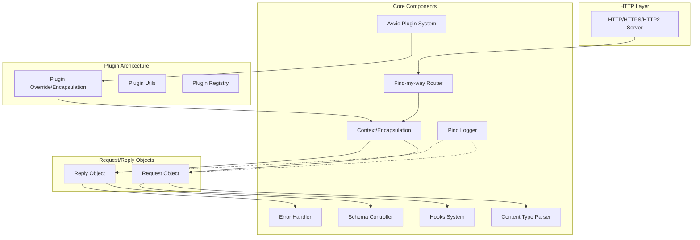
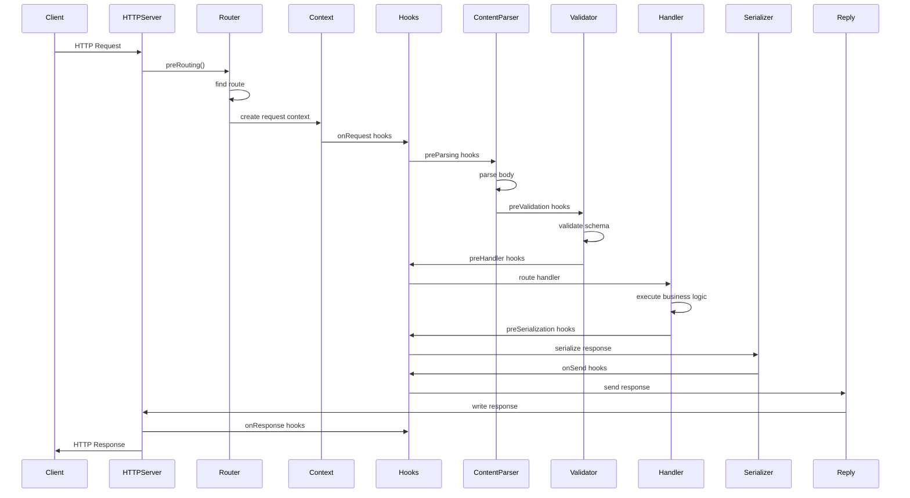

# Fastify Architecture Diagram

## Overview
Fastify is a high-performance web framework for Node.js with a focus on providing excellent developer experience through a plugin architecture and low overhead.

## High-Level Architecture



## Detailed Request Lifecycle



## Component Architecture

### 1. Core Entry Point (`fastify.js`)
- Initializes the framework
- Sets up HTTP server
- Configures Avvio for plugin management
- Exposes public API

### 2. Routing System (`lib/route.js` & find-my-way)
- **Router**: Uses find-my-way for high-performance routing
- **Route Registration**: Handles route configuration and setup
- **Method Handlers**: Support for all HTTP methods
- **Constraints**: Version constraints, host constraints, etc.

### 3. Plugin System (Avvio & `lib/pluginOverride.js`)
- **Encapsulation**: Each plugin has its own context
- **Inheritance**: Prototypal inheritance for context isolation
- **Dependencies**: Plugin dependency management
- **Registration**: Plugin registration and validation

### 4. Hooks System (`lib/hooks.js`)
```
Application Hooks:
├── onRoute      - Called when route registered
├── onRegister   - Called when plugin registered  
├── onReady      - Called when server ready
├── onListen     - Called when server listening
├── preClose     - Called before server closes
└── onClose      - Called when server closed

Lifecycle Hooks (per request):
├── onRequest        - First hook in request
├── preParsing       - Before body parsing
├── preValidation    - Before validation
├── preHandler       - Before route handler
├── preSerialization - Before serialization
├── onSend          - Before sending response
├── onResponse      - After response sent
├── onError         - On error
├── onTimeout       - On request timeout
└── onRequestAbort  - On request abort
```

### 5. Context System (`lib/context.js`)
- Holds route-specific configuration
- Contains hooks for the route
- Manages schema validation/serialization
- Handles error handling context

### 6. Request/Reply Objects
- **Request** (`lib/request.js`): Wraps Node.js request with Fastify features
- **Reply** (`lib/reply.js`): Enhanced response object with serialization, headers, status codes

### 7. Schema Management (`lib/schema-controller.js`)
- **Validation**: JSON Schema validation using AJV
- **Serialization**: Fast JSON stringification
- **Compilation**: Schema compilation and caching
- **Schema Store**: Centralized schema storage

### 8. Content Type Parser (`lib/contentTypeParser.js`)
- Parses request bodies based on content-type
- Built-in parsers for JSON, text, etc.
- Custom parser support
- Body size limits

### 9. Error Handling (`lib/error-handler.js`)
- Centralized error handling
- Custom error handlers per route
- Error serialization
- 4xx/5xx response handling

## Plugin Encapsulation Model

```
Root Instance
├── Plugin A (isolated context)
│   ├── Routes
│   ├── Decorators
│   └── Sub-Plugin A1
├── Plugin B (isolated context)
│   ├── Routes
│   ├── Decorators
│   └── Sub-Plugin B1
└── Plugin C (isolated context)
    ├── Routes
    └── Decorators
```

Each plugin:
- Has its own Request/Reply/Context
- Can't access sibling plugin internals
- Inherits from parent context
- Can be prefixed for route namespacing

## Key Design Patterns

1. **Decorator Pattern**: For extending Request/Reply/Fastify instances
2. **Plugin Pattern**: Modular architecture with encapsulation
3. **Hook Pattern**: Lifecycle management and extensibility
4. **Factory Pattern**: Building contexts, schemas, parsers
5. **Prototype Chain**: For encapsulation and inheritance

## Performance Optimizations

1. **Schema Compilation**: Pre-compiled validation and serialization
2. **Route Compilation**: Radix tree-based routing (find-my-way)
3. **Reusable Contexts**: Context objects are pre-built
4. **Lazy Loading**: Components loaded only when needed
5. **Fast JSON Stringify**: Optimized JSON serialization

## Security Features

1. **Prototype Poisoning Protection**: Built into content parsers
2. **Schema Validation**: Input validation by default
3. **Error Message Sanitization**: Prevents information leakage
4. **Request ID Generation**: For tracing and debugging

## Dependencies

- **avvio**: Plugin system and boot sequence
- **find-my-way**: HTTP router
- **fast-json-stringify**: Fast JSON serialization
- **@fastify/ajv-compiler**: JSON Schema validation
- **pino**: Logger
- **light-my-request**: HTTP injection for testing

## File Structure Mapping

```
fastify/
├── fastify.js              - Main entry point
├── lib/
│   ├── route.js           - Route registration & handling
│   ├── hooks.js           - Hook system implementation
│   ├── context.js         - Request context
│   ├── reply.js           - Reply implementation
│   ├── request.js         - Request implementation
│   ├── contentTypeParser.js - Body parsing
│   ├── pluginOverride.js  - Plugin encapsulation
│   ├── pluginUtils.js     - Plugin utilities
│   ├── schema-controller.js - Schema management
│   ├── handleRequest.js   - Request lifecycle
│   ├── error-handler.js   - Error handling
│   ├── server.js          - HTTP server setup
│   ├── fourOhFour.js      - 404 handling
│   └── ...                - Other utilities
├── types/                  - TypeScript definitions
└── test/                   - Test suite
```

This architecture enables Fastify to achieve:
- High performance through optimized code paths
- Excellent developer experience through plugins
- Type safety with TypeScript support
- Extensibility through hooks and decorators
- Encapsulation for better code organization