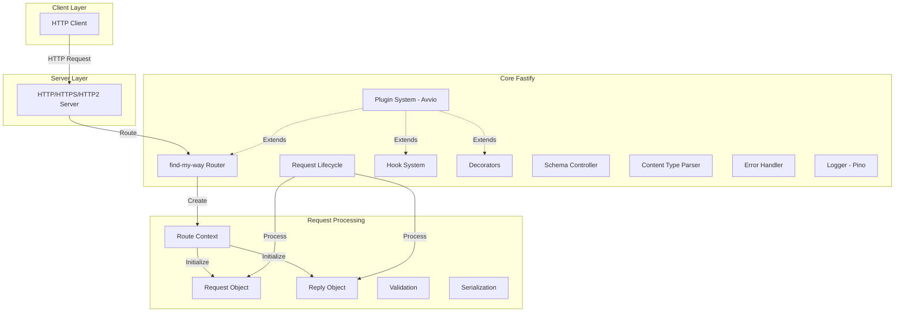
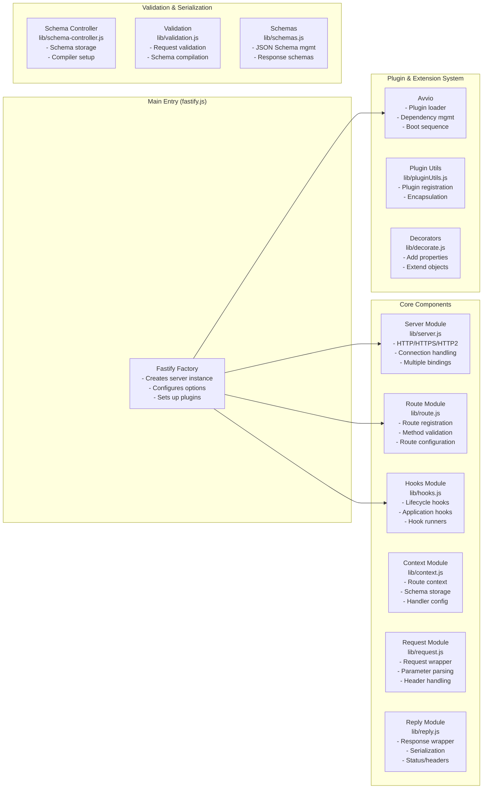
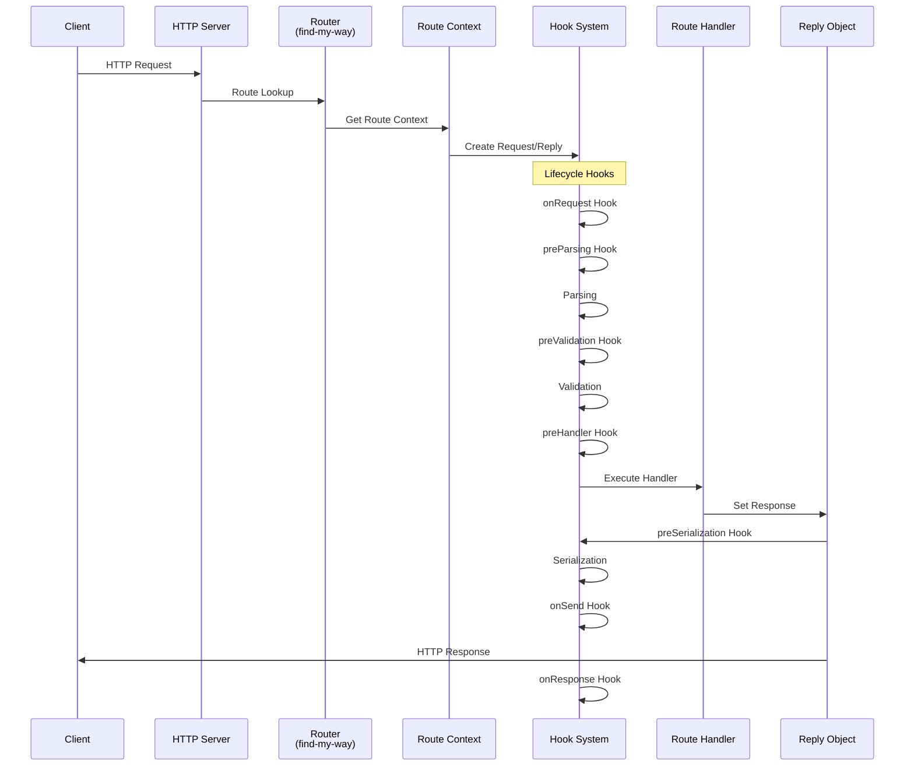
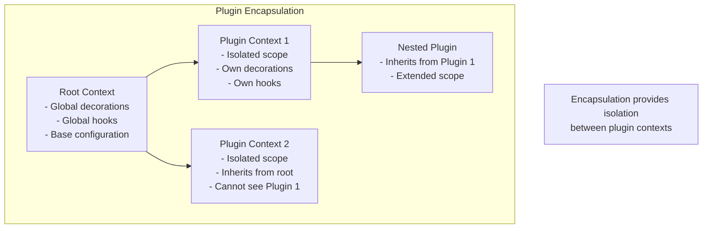
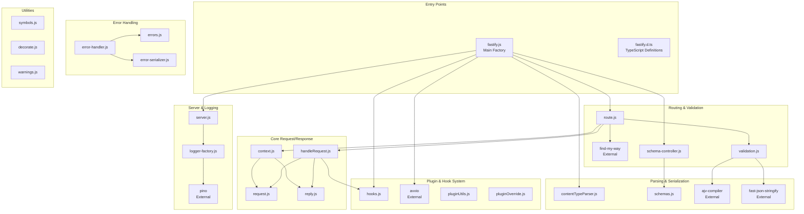
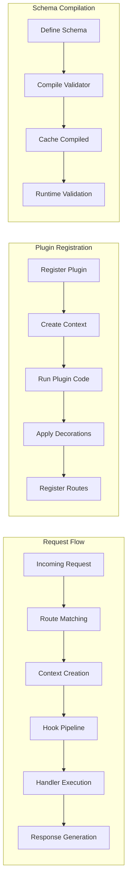

# Fastify Architecture Diagram

## High-Level Architecture Overview

## Detailed Component Architecture

## Request Lifecycle Flow

## Plugin System Architecture

## Internal Module Dependencies

## Key Architectural Components

### 1. **Core Server (lib/server.js)**
- Handles HTTP/HTTPS/HTTP2 server creation
- Manages multiple network bindings
- Handles server lifecycle (listen, close)
- Connection management

### 2. **Routing System (lib/route.js + find-my-way)**
- High-performance router using find-my-way
- Supports parametric routes
- Constraint-based routing
- Method validation

### 3. **Hook System (lib/hooks.js)**
- **Lifecycle Hooks**: onRequest, preParsing, preValidation, preHandler, preSerialization, onSend, onResponse, onError
- **Application Hooks**: onRoute, onRegister, onReady, onListen, preClose, onClose
- Async/sync hook support
- Hook inheritance through encapsulation

### 4. **Plugin System (Avvio)**
- Encapsulated plugin contexts
- Dependency management
- Asynchronous boot sequence
- Plugin isolation

### 5. **Content Type Parser (lib/contentTypeParser.js)**
- Pluggable parsers for different content types
- Built-in parsers for JSON, text
- Custom parser support
- Body size limiting

### 6. **Schema Validation System**
- JSON Schema support
- Request/response validation
- Compiler plugins (AJV default)
- Serialization optimization

### 7. **Decorator System (lib/decorate.js)**
- Extend Fastify instance
- Extend Request/Reply objects
- Encapsulation-aware

### 8. **Error Handling (lib/error-handler.js)**
- Centralized error handling
- Custom error handlers per route
- Error serialization
- Schema validation errors

### 9. **Logging (lib/logger.js + Pino)**
- High-performance structured logging
- Request/response logging
- Child loggers per request
- Custom serializers

## Data Flow Patterns

## Key Design Principles

1. **High Performance**: Optimized for speed with careful hot-path optimization
2. **Encapsulation**: Plugin contexts provide isolation and prevent conflicts
3. **Extensibility**: Decorators and hooks allow extending functionality
4. **Schema-First**: JSON Schema validation built into the core
5. **Asynchronous**: Full async/await and promise support
6. **Low Overhead**: Minimal abstractions in the request path

## File Structure Mapping

- **Entry Point**: `fastify.js`
- **Core Modules**: `lib/`
  - Request/Reply handling
  - Routing and hooks
  - Plugin system integration
- **Type Definitions**: `types/` (TypeScript support)
- **Tests**: `test/` (comprehensive test suite)
- **Documentation**: `docs/` (guides and references)

This architecture enables Fastify to be both highly performant and developer-friendly, with a plugin system that promotes code reusability and maintainability.